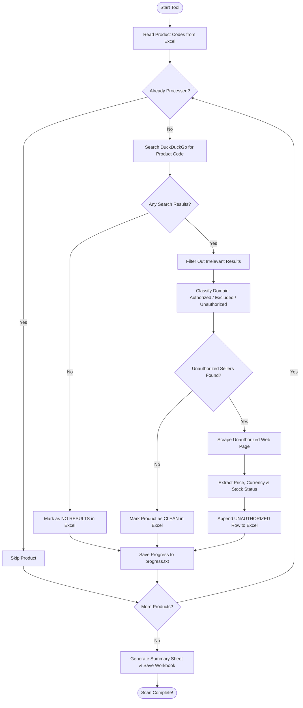
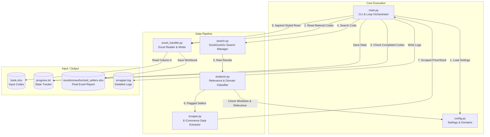
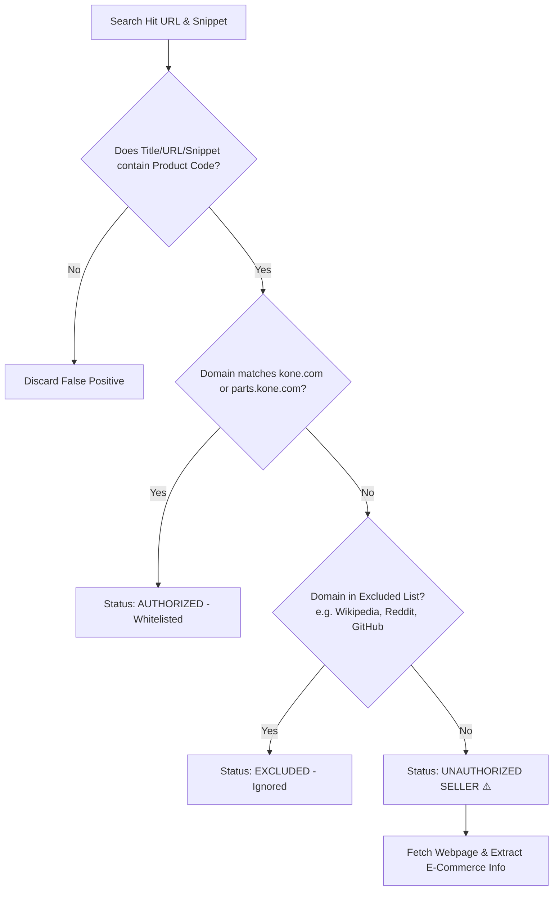

# 🔍 KONE Unauthorized Seller Detection Tool

> An automated web intelligence tool designed to search the web for official **KONE product/material codes**, detect unauthorized third-party online vendors, scrape price & stock data, and generate styled Excel reports.

---

## 📋 Table of Contents

- [Overview](#-overview)
- [Key Features](#-key-features)
- [How It Works (Architecture & Diagrams)](#-how-it-works-architecture--diagrams)
  - [1. High-Level Workflow](#1-high-level-workflow)
  - [2. System Architecture](#2-system-architecture)
  - [3. Decision Logic Flow](#3-decision-logic-flow)
- [Beginner's Quick Start Guide](#-beginners-quick-start-guide)
  - [Prerequisites](#prerequisites)
  - [Step 1: Open Terminal / Command Prompt](#step-1-open-terminal--command-prompt)
  - [Step 2: Create a Virtual Environment (Recommended)](#step-2-create-a-virtual-environment-recommended)
  - [Step 3: Install Required Dependencies](#step-3-install-required-dependencies)
- [Preparing Input Data](#-preparing-input-data)
- [Running the Tool](#-running-the-tool)
  - [Basic Usage](#basic-usage)
  - [Custom Input File](#custom-input-file)
  - [Resetting & Starting Fresh](#resetting--starting-fresh)
- [Understanding the Results & Reports](#-understanding-the-results--reports)
  - [Excel Output Sheet](#excel-output-sheet)
  - [Color Coding Guide](#color-coding-guide)
  - [Summary Dashboard](#summary-dashboard)
- [Customizing Settings (`config.py`)](#-customizing-settings-configpy)
- [File & Directory Structure](#-file--directory-structure)
- [Troubleshooting & FAQ](#-troubleshooting--faq)

---

## 💡 Overview

When KONE manufactures and distributes elevator/escalator components, unauthorized third-party vendors sometimes list these genuine or grey-market part numbers online. Finding these sellers manually across hundreds of product codes takes hours of tedious searching.

This tool automates the entire process:
1. **Reads** a list of KONE material codes (e.g., `DEE0079892`) from an Excel spreadsheet.
2. **Searches** the web using DuckDuckGo to discover where these codes are being offered for sale.
3. **Filters out** authorized KONE websites (`kone.com`) and non-commercial sites (Wikipedia, social media, forums).
4. **Scrapes** unauthorized vendor pages to extract product prices, currencies, and stock availability.
5. **Generates** a formatted Excel report with color-coded alerts and an executive summary dashboard.

---

## ⭐ Key Features

- **Free & API-Key-Free**: Uses DuckDuckGo search via the `ddgs` Python library. No paid search APIs required.
- **Smart Stealth & Anti-Blocking**: Built-in human-like random delays, User-Agent header rotation, and rate-limit backoffs to prevent getting blocked by search engines or target websites.
- **Multi-Stage Price & Stock Scraper**: Automatically extracts pricing and stock availability using structured metadata (JSON-LD, Microdata, Open Graph) and common e-commerce HTML patterns.
- **Crash Resilience & Auto-Resume**: Saves progress after every product. If your internet disconnects or your computer restarts, simply re-run the tool to resume right where it left off.
- **Professional Excel Output**: Styled with frozen headers, auto-filters, color-coded rows, and a auto-generated **Summary Dashboard**.
- **Beginner Friendly**: Simple setup, automated logging, and command-line progress bars via `tqdm`.

---

## 📐 How It Works (Architecture & Diagrams)

### 1. High-Level Workflow

Below is the step-by-step journey of how a product code is processed from start to finish:



---

### 2. System Architecture

The project is structured into modular Python files, each handling a single responsibility:



---

### 3. Decision Logic Flow

How the tool decides whether a web search result is an **Unauthorized Seller**:



---

## 🚀 Beginner's Quick Start Guide

Follow these simple steps to run the tool on your computer.

### Prerequisites
Make sure you have **Python 3.10** or higher installed on your computer.
- You can check by running `python --version` or `python3 --version` in your terminal.

---

### Step 1: Open Terminal / Command Prompt

Navigate to the project folder:

**On Windows (PowerShell / Command Prompt):**
```powershell
cd "d:\Saffy Projects\scrapper"
```

**On macOS / Linux:**
```bash
cd "/path/to/scrapper"
```

---

### Step 2: Create a Virtual Environment (Recommended)

Creating a virtual environment keeps your Python packages isolated and clean.

**On Windows:**
```powershell
python -m venv venv
.\venv\Scripts\activate
```

**On macOS / Linux:**
```bash
python3 -m venv venv
source venv/bin/activate
```

*(You will see `(venv)` appear at the beginning of your command line prompt).*

---

### Step 3: Install Required Dependencies

Install all required Python libraries with a single command:

```bash
pip install -r requirements.txt
```

This installs:
- `openpyxl`: To read and write Excel `.xlsx` files with custom colors and styles.
- `requests`: To download seller webpages.
- `beautifulsoup4`: To parse and extract HTML, JSON-LD, and price data.
- `ddgs`: DuckDuckGo search integration.
- `tqdm`: Visual progress bars in your terminal.

---

## 📊 Preparing Input Data

The tool reads product codes from an Excel spreadsheet.

By default, it looks for a file named `book.xlsx` in the root folder.
- Put your product codes in **Column A** (Row 1 can be a header like `Material Code`).
- Example `book.xlsx` layout:

| Row | Column A (Material Code) |
|---|---|
| 1 | **Material Code** |
| 2 | DEE0079892 |
| 3 | DEE0090890 |
| 4 | DEE0095380 |
| 5 | KM713180G01 |

---

## 🏃 Running the Tool

### Basic Usage

To run the scan using default settings (`book.xlsx`):

```bash
python main.py
```

You will see an interactive progress bar showing current progress, estimated time remaining, and real-time logs.

---

### Custom Input File

If your input Excel file has a different name or path, use the `--input` flag:

```bash
python main.py --input my_kone_parts.xlsx
```

---

### Resetting & Starting Fresh

If you want to clear previous progress and restart the scan from scratch:

```bash
python main.py --reset
```

*(This clears `progress.txt` and removes old generated Excel files in `results/`).*

---

## 📈 Understanding the Results & Reports

Output reports are automatically created inside the `results/` folder with names like:
`results/unauthorized_sellers_20260910_153000.xlsx`

### Excel Output Sheet

The **Unauthorized Sellers** worksheet contains detailed columns for every finding:

| Material Code | Status | Seller Domain | Seller URL | Page Title | Price | Currency | Stock Status | Search Snippet | Scrape Error |
|---|---|---|---|---|---|---|---|---|---|
| `DEE0079892` | ⚠️ UNAUTHORIZED | `elevator-parts-shop.com` | `https://...` | KONE Main Switch | 149.99 | EUR | In Stock | Genuine KONE part... | |
| `DEE0090890` | ✅ CLEAN | | | | | | | | |

---

### Color Coding Guide

To make review effortless, rows are styled visually:

- 🔴 **Soft Red (`⚠️ UNAUTHORIZED`)**: An unauthorized third-party vendor was found selling or listing this part.
- 🟢 **Soft Green (`✅ CLEAN`)**: No unauthorized seller domains were found.
- 🟡 **Soft Yellow (`❌ ERROR`)**: An error occurred while searching or processing.
- ⚪ **Plain Text (`🔍 NO RESULTS`)**: No internet search results were found for this product code.

---

### Summary Dashboard

Every generated Excel report includes an executive **Summary** tab containing key statistics:
- **Total Products Scanned**
- **Count of Products with Unauthorized Sellers**
- **Clean Product Count**
- **Top Unauthorized Seller Domains** (ranked by frequency of occurrence across your product list)

---

## ⚙️ Customizing Settings (`config.py`)

All operational settings are centralized in `config.py`. You can open `config.py` in any text editor to adjust settings:

### Whitelisted & Excluded Domains
- **`AUTHORIZED_DOMAINS`**: Domains that belong to official channels (e.g. `kone.com`, `parts.kone.com`). Hits on these domains are marked as `AUTHORIZED` and ignored.
- **`EXCLUDED_DOMAINS`**: Non-commerce sites to ignore (e.g. `wikipedia.org`, `youtube.com`, `reddit.com`, `github.com`).

### Rate Limiting & Delays
To stay respectful to search engine servers and prevent IP blocks:
- **`SEARCH_DELAY_MIN` / `SEARCH_DELAY_MAX`**: Delay (in seconds) between individual searches (Default: 4–8 seconds).
- **`LONG_PAUSE_EVERY_N`**: After every N searches, trigger a longer pause (Default: every 30 searches).
- **`LONG_PAUSE_MIN` / `LONG_PAUSE_MAX`**: Duration of the long pause (Default: 30–60 seconds).

---

## 📁 File & Directory Structure

```text
scrapper/
├── config.py           # Central configuration, whitelists, delays, & headers
├── search.py           # DuckDuckGo search integration & rate-limiter
├── analyzer.py         # Relevance filtering & domain classification module
├── scraper.py          # E-commerce HTML/JSON-LD price & stock extraction engine
├── excel_handler.py    # Excel reading & styled report creation using openpyxl
├── main.py             # CLI entry point, execution loop & crash recovery
├── requirements.txt    # List of required Python packages
├── book.xlsx           # Default input Excel file containing product codes
├── progress.txt        # Auto-generated state file for resuming interrupted scans
├── scrapper.log        # Auto-generated detailed execution logs
└── results/            # Directory where output Excel reports are saved
```

---

## ❓ Troubleshooting & FAQ

### Q1: The scan stopped halfway through or my computer restarted. Do I lose my progress?
**No!** The tool continuously writes completed product codes to `progress.txt`. Simply open your terminal and run `python main.py` again. It will automatically load `progress.txt`, skip already processed items, and pick up right where it stopped.

---

### Q2: Why are some prices blank in the report?
Some websites use complex JavaScript rendering (Single Page Applications) or require user interaction to reveal prices. The tool uses static HTTP scraping strategies (JSON-LD, Microdata, Open Graph, CSS selectors). If a page relies on heavy client-side JavaScript, the URL, domain, and search snippet will still be recorded, but the scraped price field may remain blank.

---

### Q3: How do I add a domain to the whitelist or exclusion list?
Open `config.py` in a text editor:
- To whitelist an official store, add it to `AUTHORIZED_DOMAINS` (e.g., `"mypartner.kone.com"`).
- To exclude a news site or blog, add it to `EXCLUDED_DOMAINS` (e.g., `"industrynews.com"`).

---

### Q4: I get a `ModuleNotFoundError` when running `python main.py`.
This means your Python environment hasn't installed the required packages yet. Make sure you activated your virtual environment and ran:
```bash
pip install -r requirements.txt
```

---

<p align="center">
  <i>Developed for KONE brand protection & unauthorized seller monitoring.</i>
</p>
